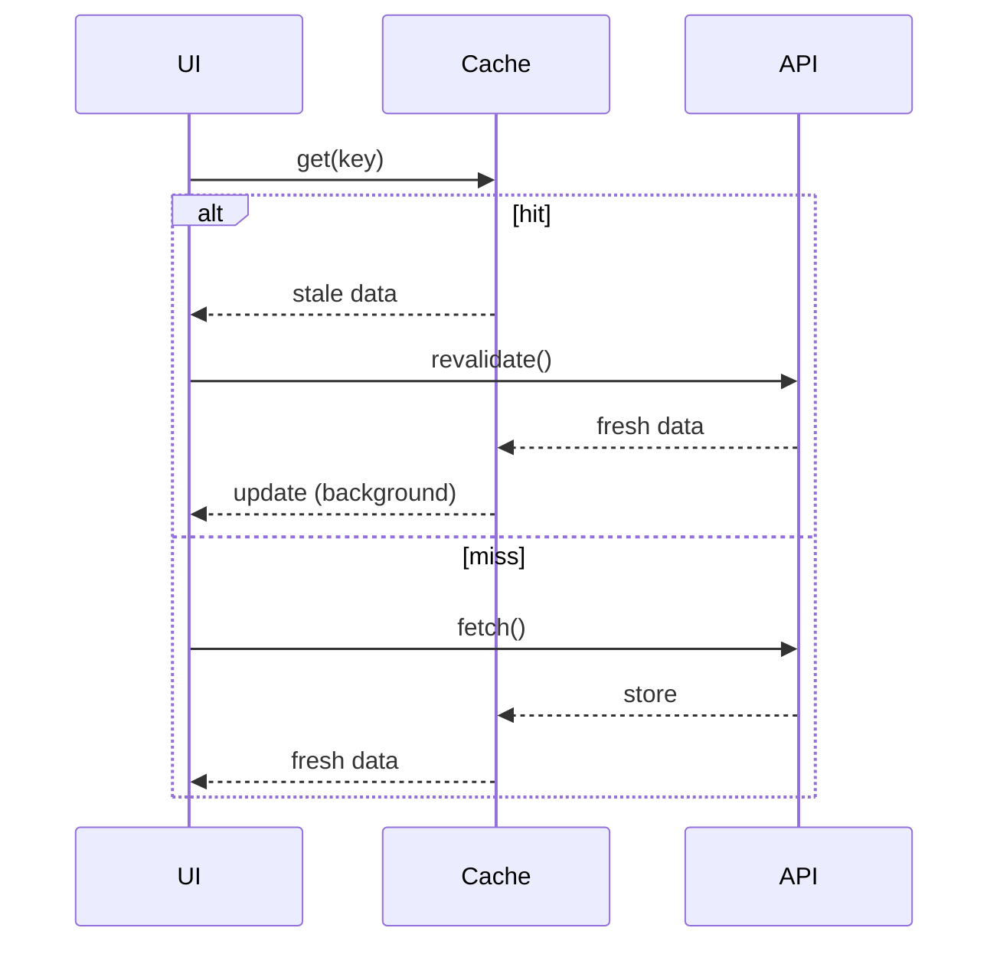

## TL;DR
- Cache em camadas reduz latência e evita custo repetido.
- SWR (stale-while-revalidate) entrega UX rápida com consistência eventual.
- O risco é servir dado “antigo”: trate com indicadores e política clara.

## Camadas
1) memória (runtime)
2) localStorage (cliente)
3) CDN (assets estáticos)
4) storage (S3) ou DB

## Política
- Dados críticos: TTL curto e revalidação imediata.
- Dados “estratégicos”: TTL maior com aviso “Atualizado em...”.

