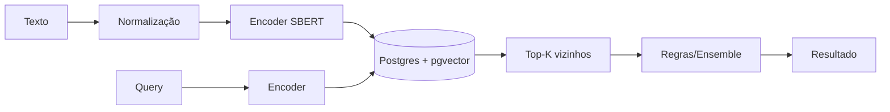

## TL;DR
- Embeddings são uma interface matemática estável para busca e matching semântico.
- Postgres + pgvector resolve 80% dos casos sem adicionar um “banco novo” no stack.
- O trade-off é: tuning do índice + métricas de qualidade (recall/latência).

## Por que embeddings (e não LLM generativo)?
Embeddings são **discriminativos**: você compara vetores e toma decisões reproduzíveis.  
LLMs são ótimos para geração, mas trazem variância e custo para tarefas que às vezes são puramente de similaridade.

## Arquitetura (macro)

## Métricas que importam
- Latência p95 (busca e endpoint)
- Recall@K (avaliação offline)
- Drift semântico (se o domínio muda)
- Custo (CPU/RAM, índices, IO)

## Próximos passos
- Medir recall@K com um conjunto rotulado
- Ajustar índice (HNSW params) e batch de ingestão
- Instrumentar logs de consulta e alertas
